# MVP: Construção de um Pipeline de Dados na Nuvem (Databricks Lakehouse)
**Projeto:** Inteligência de Dados para Direcionamento e *Greenlight* de IP Própria no Mercado Brasileiro de Games

Este repositório apresenta o Produto Mínimo Viável (MVP) de um pipeline de Engenharia de Dados construído do zero no **Databricks Free Edition**, utilizando **PySpark**, **Spark SQL**, **Delta Lake** e governança no **Unity Catalog** sob o padrão de **Arquitetura Medalhão (Bronze, Silver e Gold)**.

### Scripts e Notebooks do Projeto
* [`01_Ingestao_Bronze.ipynb`](./01_Ingestao_Bronze.ipynb): Coleta do arquivo bruto no Volume do Unity Catalog e ingestão na camada Bronze com metadados de rastreabilidade.
* [`02_Qualidade_e_Transformacao_Silver.ipynb`](./02_Qualidade_e_Transformacao_Silver.ipynb): Diagnóstico das 5 dimensões de qualidade de dados, tratamento de anomalias estruturais, padronização e enriquecimento na camada Silver.
* [`03_Modelagem_StarSchema_Gold.ipynb`](./03_Modelagem_StarSchema_Gold.ipynb): Modelagem dimensional em Esquema Estrela (*Star Schema*) na camada Gold e registro automatizado do Catálogo de Dados.
* [`04_Analise_de_Negocio_SQL.ipynb`](./04_Analise_de_Negocio_SQL.ipynb): Consultas analíticas em SQL respondendo às perguntas estratégicas para criação de jogos próprios.

---

# Contexto de Negócios e Perguntas (Etapa 2. e 4.1)

## Problema de Negócio: Expansão para Desenvolvimento de Jogos Próprios (IP Própria)
Atuando em uma empresa do setor de jogos digitais que historicamente operou na prestação de serviços e *co-development*, a diretoria iniciou o planejamento estratégico para expandir sua atuação rumo à **criação e publicação de jogos próprios (Propriedade Intelectual — IP Própria)** com foco primário de tração no público brasileiro e distribuição global via **Steam**.

O desenvolvimento de uma IP original envolve alto risco financeiro: escolher um gênero saturado, errar na precificação ou subestimar o investimento em localização (tradução textual versus dublagem em Português-BR) pode comprometer a viabilidade comercial do projeto antes mesmo do lançamento. 

Para substituir decisões baseadas apenas em intuição por decisões orientadas a dados (*Data-Driven Greenlight*), este MVP constrói um pipeline de dados na nuvem capaz de processar o histórico do catálogo da Steam e responder às questões críticas de **posicionamento de produto, localização, engajamento e monetização** da nossa futura IP.

## Perguntas de Negócio que Guiam o Pipeline
Para direcionar o investimento na nova IP voltada ao público brasileiro, foram estruturadas **6 perguntas estratégicas**:

1. **Maturidade da Localização no Brasil:** Como evoluiu a proporção de lançamentos anuais na Steam com suporte ao idioma Português-BR (interface/legenda e dublagem em áudio) na última década (2015–2025)?
2. **Retorno do Investimento em Localização PT-BR:** Qual é o impacto do nível de localização para o Português-BR (`Sem Suporte`, `Apenas Texto / Legenda PT-BR` e `Dublagem Completa`) na taxa média de aprovação dos jogadores, no volume de avaliações e na proporção de títulos que superam 20.000 cópias vendidas?
3. **Priorização de Tradução por Gênero:** Quais gêneros de jogos sofrem a maior penalidade na aprovação dos usuários quando não oferecem tradução para o Português-BR?
4. **Identificação de "Oceano Azul" para a Nova IP (Gênero x Modalidade):** Considerando lançamentos recentes (a partir de 2020) localizados em PT-BR por estúdios de porte independente/médio, quais combinações de Gênero e Modalidade (*Exclusivo Single-player* vs. *Multiplayer / Co-op*) apresentam a maior taxa de sucesso comercial (jogos acima de 50 mil cópias estimadas) e retenção de horas jogadas frente ao número de concorrentes lançados?
5. **Estratégia de Monetização, Preço Base e Vida Útil via DLCs:** Nos jogos localizados para o Brasil, como a combinação entre a Faixa de Preço de lançamento e a estratégia de expansões (quantidade de DLCs) impacta a longevidade da IP (horas jogadas), o pico de usuários simultâneos (`peak_ccu`) e a aprovação da comunidade?
6. **Sentimento Regional vs. Global:** Qual é a diferença entre a nota média atribuída exclusivamente por jogadores residentes no Brasil e a nota média global dos jogos?

## Contexto dos Dados Brutos, Estrutura Original e Licença de Uso
* **Fonte dos Dados:** Conjunto de dados público **Steam Games Dataset**, compilado por *FronkonGames* via API oficial da Steam Store e SteamSpy, disponível no Kaggle (`https://www.kaggle.com/datasets/fronkongames/steam-games-dataset`).
* **Licença de Uso:** Distribuído sob licença aberta **MIT License / ODbL (Open Database License)**, que permite livre utilização acadêmica e comercial, adaptação, transformação e compartilhamento mediante citação da fonte.
* **Resumo da Estrutura dos Dados Brutos:** Arquivo estático `games.csv` composto por mais de 80.000 registros de jogos e 39 colunas originais:
  * **Identificadores e Metadados:** `AppID`, `Name`, `Release date`, `Required age`, `About the game`.
  * **Comercialização e Porte:** `Price`, `DLC count`, `Estimated owners`, `Developers`, `Publishers`.
  * **Atributos Multivalorados (Listas em String):** `Supported languages`, `Full audio languages`, `Categories`, `Genres`, `Tags`.
  * **Plataformas:** `Windows`, `Mac`, `Linux`.
  * **Métricas de Desempenho e Retenção:** `Positive`, `Negative`, `User score`, `Average playtime forever`, `Median playtime forever`, `Peak CCU`.

---

# Carga dos Dados (Etapa 4.2)

## Processo de Coleta e Ingestão na Nuvem
A carga dos dados brutos para a nuvem foi realizada dentro do ambiente **Databricks Free Edition** utilizando os recursos de armazenamento do **Unity Catalog**, conforme documentado no notebook [`01_Ingestao_Bronze.ipynb`](./01_Ingestao_Bronze.ipynb):

1. **Upload para Volume em Nuvem:** Foi criado o schema `workspace.bronze` e o Volume gerenciado `/Volumes/workspace/bronze/arquivos_brutos/`. O arquivo `games.csv` foi carregado diretamente para este Volume através da ferramenta nativa de ingestão de dados do Databricks.
2. **Leitura Resiliente em PySpark:** O script lê o arquivo CSV do Volume utilizando `.option("multiLine", "true")` e `.option("escape", "\"")` para preservar descrições longas com quebras de linha, mantendo todas as colunas em formato texto bruto (`inferSchema = false`) a fim de garantir fidelidade total à fonte original na camada Bronze.
3. **Metadados de Controle e Gravação Delta:** Após normalizar caracteres especiais nos nomes das colunas para compatibilidade com o Delta Lake, foram adicionados os metadados de controle `_data_ingestao` (`current_timestamp()`), `_arquivo_origem` (`_metadata.file_path`) e `_fonte_dados`, salvando o conjunto de dados na tabela `workspace.bronze.steam_games_raw`.

### Evidências da Carga dos Dados
> **Evidência 1 — Arquivo CSV bruto armazenado no Volume do Unity Catalog (`/Volumes/workspace/bronze/arquivos_brutos/games.csv`):**
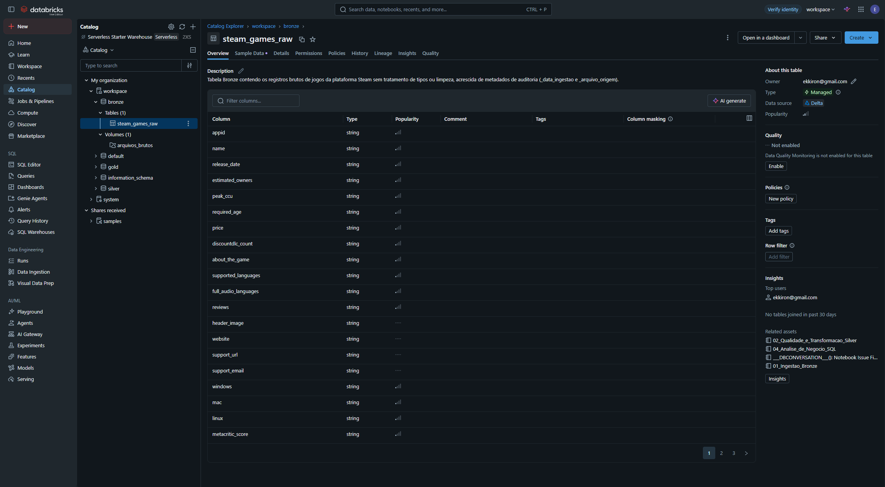

> **Evidência 2 — Registros e metadados de controle gravados na tabela `workspace.bronze.steam_games_raw`:**
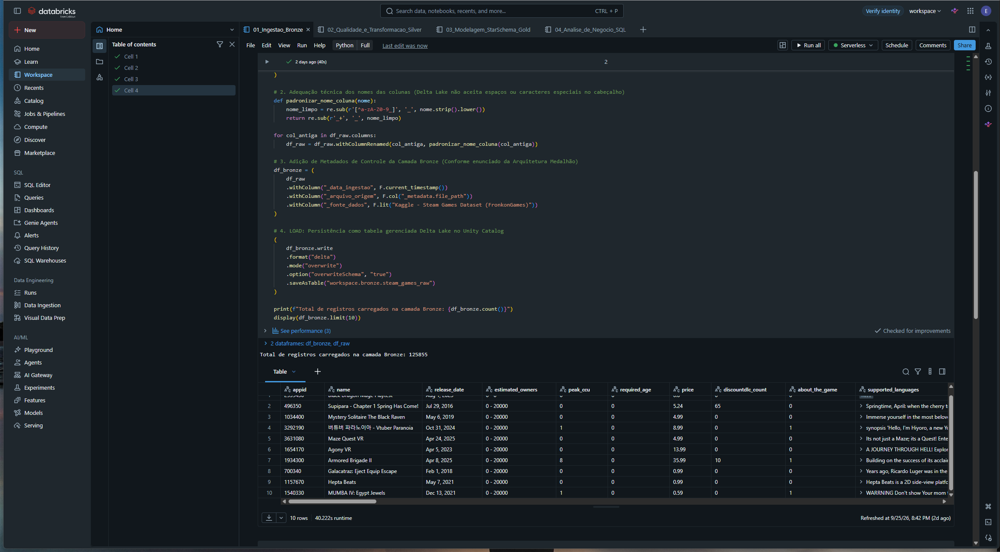

---

# Modelagem e Catálogo de Dados (Etapa 4.3)

## Explicação da Modelagem Dimensional (Star Schema na Camada Gold)
Para transformar os dados limpos em uma estrutura otimizada para tomada de decisão sobre a nossa futura IP, foi modelado um **Esquema Estrela (Star Schema)** no schema `workspace.gold` (implementado no script [`03_Modelagem_StarSchema_Gold.ipynb`](./03_Modelagem_StarSchema_Gold.ipynb)).

O modelo isola as medidas numéricas de desempenho comercial e engajamento na tabela fato central **`fato_desempenho_jogos`**, cercada por **4 tabelas dimensão** (`dim_localizacao_br`, `dim_classificacao_jogo`, `dim_calendario` e `dim_jogo_detalhes`). Essa estrutura reduz a complexidade das consultas analíticas e permite fatiar rapidamente as métricas por grau de localização em Português-BR, gênero, modalidade multiplayer, faixa de preço e ano de lançamento.

### Diagrama Entidade-Relacionamento (Camada Gold)

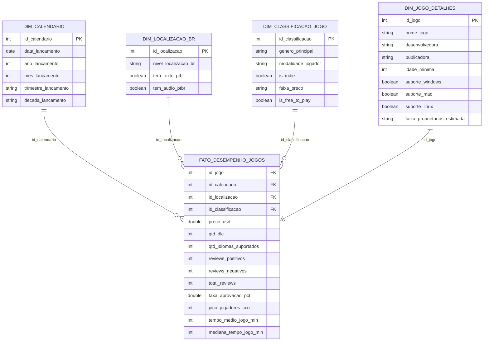

---

## Catálogo de Dados Transcrito (Unity Catalog)

Abaixo encontra-se o Catálogo de Dados completo das 5 tabelas da camada Gold, contendo contexto, tipos de dados, domínios de valores esperados e linhagem técnica.

### 1. Tabela Fato: `workspace.gold.fato_desempenho_jogos`
* **Contexto da Tabela:** Tabela Fato central contendo as métricas quantitativas de preço, expansões (DLCs), volume de avaliações, taxa de aprovação, pico de usuários simultâneos e tempo de retenção de cada jogo.

| Campo (Coluna) | Tipo | Descrição | Domínio de Valores | Linhagem dos Dados |
| :--- | :--- | :--- | :--- | :--- |
| `id_jogo` | `INT` | FK para `dim_jogo_detalhes` identificando o jogo (`AppID`). | Inteiros > `0` | `silver.steam_games_clean.id_jogo` (`bronze.app_id`) |
| `id_calendario` | `INT` | FK para `dim_calendario` representando a data de lançamento. | `19970101` a `20261231` | `INNER JOIN` com `gold.dim_calendario` |
| `id_localizacao` | `INT` | FK para `dim_localizacao_br` indicando o nível de suporte ao PT-BR. | `1`, `2`, `3` | `INNER JOIN` com `gold.dim_localizacao_br` |
| `id_classificacao` | `INT` | FK para `dim_classificacao_jogo` com o perfil de gênero e preço. | Inteiros >= `1` | `INNER JOIN` com `gold.dim_classificacao_jogo` |
| `preco_usd` | `DOUBLE` | Preço base de venda na Steam em dólares americanos. | `0.00` a `500.00` USD | `silver.steam_games_clean.preco_usd` (`bronze.price`) |
| `qtd_dlc` | `INT` | Quantidade de pacotes de expansão (DLCs) lançados para o jogo. | Inteiros >= `0` | `silver.steam_games_clean.qtd_dlc` |
| `qtd_idiomas_suportados` | `INT` | Total de idiomas suportados na interface/texto do jogo. | Inteiros >= `1` | Calculado na Silver via `SIZE(SPLIT(idiomas_texto_limpo, ','))` |
| `reviews_positivos` | `INT` | Total acumulado de avaliações positivas recebidas. | Inteiros >= `0` | `silver.steam_games_clean.reviews_positivos` |
| `reviews_negativos` | `INT` | Total acumulado de avaliações negativas recebidas. | Inteiros >= `0` | `silver.steam_games_clean.reviews_negativos` |
| `total_reviews` | `INT` | Soma total de avaliações recebidas pelo jogo. | Inteiros >= `0` | Calculado na Silver: `reviews_positivos + reviews_negativos` |
| `taxa_aprovacao_pct` | `DOUBLE` | Percentual de avaliações positivas sobre o total de avaliações. | `0.00` a `100.00` (ou `NULL` se sem avaliações) | Calculado na Silver: `ROUND((reviews_positivos / total_reviews) * 100, 2)` |
| `pico_jogadores_ccu` | `INT` | Pico máximo registrado de jogadores simultâneos (*Concurrent Users*). | Inteiros >= `0` | `silver.steam_games_clean.pico_jogadores_ccu` (`bronze.peak_ccu`) |
| `tempo_medio_jogo_min` | `INT` | Tempo médio histórico jogado pelos usuários em minutos. | Inteiros >= `0` | `silver.steam_games_clean.tempo_medio_jogo_min` |
| `mediana_tempo_jogo_min` | `INT` | Mediana histórica do tempo jogado pelos usuários em minutos. | Inteiros >= `0` | `silver.steam_games_clean.mediana_tempo_jogo_min` |

### 2. Tabela Dimensão: `workspace.gold.dim_localizacao_br`
* **Contexto da Tabela:** Dimensão que categoriza o grau de localização dos jogos para o mercado brasileiro (Português-BR).

| Campo (Coluna) | Tipo | Descrição | Domínio de Valores | Linhagem dos Dados |
| :--- | :--- | :--- | :--- | :--- |
| `id_localizacao` | `INT` | PK substituta (*Surrogate Key*) do nível de localização. | `1` a `3` | Gerada via `DENSE_RANK()` sobre as combinações únicas na Silver |
| `nivel_localizacao_br` | `STRING` | Categoria consolidada de suporte ao Português-BR. | `"Dublagem Completa (Áudio + Texto)"`, `"Apenas Texto / Legenda PT-BR"`, `"Sem Suporte ao Português-BR"` | Derivado na Silver pela combinação lógica de `tem_texto_ptbr` e `tem_audio_ptbr` |
| `tem_texto_ptbr` | `BOOLEAN` | Indica presença de interface e/ou legenda em Português-BR. | `true`, `false` | Extraído na Silver via expressão regular sobre os idiomas suportados |
| `tem_audio_ptbr` | `BOOLEAN` | Indica presença de dublagem em áudio em Português-BR. | `true`, `false` | Extraído na Silver via expressão regular sobre os idiomas de áudio |

### 3. Tabela Dimensão: `workspace.gold.dim_classificacao_jogo`
* **Contexto da Tabela:** Dimensão analítica com o perfil mercadológico do jogo (gênero principal, modalidade multiplayer/single-player, porte indie e faixa de preço).

| Campo (Coluna) | Tipo | Descrição | Domínio de Valores | Linhagem dos Dados |
| :--- | :--- | :--- | :--- | :--- |
| `id_classificacao` | `INT` | PK substituta (*Surrogate Key*) da combinação de perfil. | Inteiros >= `1` | Gerada via `DENSE_RANK()` a partir da camada Silver |
| `genero_principal` | `STRING` | Gênero primário do jogo listado na loja. | `"Action"`, `"Indie"`, `"Adventure"`, `"RPG"`, `"Strategy"`, `"Simulation"`, `"Casual"`, `"Sports"`, `"Racing"`, etc. | Extraído na Silver via `SPLIT(generos_limpos, ',')[0]` |
| `modalidade_jogador` | `STRING` | Escopo de interação social entre jogadores. | `"Multiplayer / Co-op"`, `"Exclusivo Single-player"`, `"Outros / Não Especificado"` | Classificado na Silver via busca textual nas categorias do jogo |
| `is_indie` | `BOOLEAN` | Indica se o título possui classificação de estúdio independente (*Indie*). | `true`, `false` | Derivado na Silver verificando presença de `"indie"` nos gêneros |
| `faixa_preco` | `STRING` | Agrupamento comercial de preço em dólares. | `"1. Gratuito (Free-to-Play)"`, `"2. Até US$ 10 (Econômico)"`, `"3. US$ 10.01 a US$ 30 (Intermediário)"`, `"4. Acima de US$ 30 (Premium / AAA)"` | Derivado na Silver via regra `CASE WHEN` sobre `preco_usd` |
| `is_free_to_play` | `BOOLEAN` | Indica se o jogo é gratuito para jogar. | `true`, `false` | Derivado na Silver via `preco_usd == 0.0` |

### 4. Tabela Dimensão: `workspace.gold.dim_calendario`
* **Contexto da Tabela:** Dimensão temporal que organiza as datas de lançamento por ano, mês, trimestre e década.

| Campo (Coluna) | Tipo | Descrição | Domínio de Valores | Linhagem dos Dados |
| :--- | :--- | :--- | :--- | :--- |
| `id_calendario` | `INT` | PK numérica no formato `AAAAMMDD`. | `19970101` a `20261231` | `CAST(DATE_FORMAT(data_lancamento, 'yyyyMMdd') AS INT)` |
| `data_lancamento` | `DATE` | Data oficial de lançamento do jogo. | Datas válidas (`YYYY-MM-DD`) | Padronizado na Silver via `COALESCE` e `TRY_TO_DATE` |
| `ano_lancamento` | `INT` | Ano civil de lançamento. | `1997` a `2026` | `YEAR(data_lancamento)` |
| `mes_lancamento` | `INT` | Mês numérico de lançamento. | `1` a `12` | `MONTH(data_lancamento)` |
| `trimestre_lancamento` | `STRING` | Trimestre do ano de lançamento. | `"Q1"`, `"Q2"`, `"Q3"`, `"Q4"` | `CONCAT('Q', QUARTER(data_lancamento))` |
| `decada_lancamento` | `STRING` | Década histórica de lançamento. | `"Anos 1990"`, `"Anos 2000"`, `"Anos 2010"`, `"Anos 2020"` | `CONCAT('Anos ', FLOOR(YEAR(data_lancamento)/10)*10)` |

### 5. Tabela Dimensão: `workspace.gold.dim_jogo_detalhes`
* **Contexto da Tabela:** Dimensão cadastral contendo metadados descritivos de cada jogo, estúdios, sistemas operacionais suportados e faixa estimada de vendas.

| Campo (Coluna) | Tipo | Descrição | Domínio de Valores | Linhagem dos Dados |
| :--- | :--- | :--- | :--- | :--- |
| `id_jogo` | `INT` | PK natural do aplicativo na Steam (`AppID`). | Inteiros > `0` | `silver.steam_games_clean.id_jogo` |
| `nome_jogo` | `STRING` | Título comercial do jogo. | Texto livre não nulo | `silver.steam_games_clean.nome_jogo` |
| `desenvolvedora` | `STRING` | Estúdio(s) responsável(is) pelo desenvolvimento. | Texto livre ou `"Não Informado"` | Higienizado na Silver a partir de `developers` |
| `publicadora` | `STRING` | Empresa(s) responsável(is) pela publicação. | Texto livre ou `"Não Informado"` | Higienizado na Silver a partir de `publishers` |
| `idade_minima` | `INT` | Classificação indicativa de idade mínima. | `0` a `21` anos | `silver.steam_games_clean.idade_minima` |
| `suporte_windows` | `BOOLEAN` | Compatibilidade com sistema operacional Windows. | `true`, `false` | `silver.steam_games_clean.suporte_windows` |
| `suporte_mac` | `BOOLEAN` | Compatibilidade com sistema operacional macOS. | `true`, `false` | `silver.steam_games_clean.suporte_mac` |
| `suporte_linux` | `BOOLEAN` | Compatibilidade com sistema operacional Linux. | `true`, `false` | `silver.steam_games_clean.suporte_linux` |
| `faixa_proprietarios_estimada` | `STRING` | Faixa estimada de cópias adquiridas (SteamSpy). | Faixas categóricas (`"0 - 20000"`, `"20000 - 50000"`, ..., `"100000000 - 200000000"`) | Padronizado na Silver a partir de `estimated_owners` |

### Evidências do Catálogo de Dados e Linhagem no Databricks
> **Evidência 3 — Metadados e descrições de colunas registrados no Unity Catalog (`fato_desempenho_jogos`):**
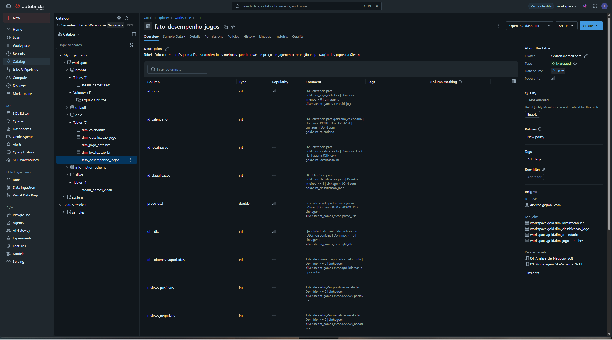

> **Evidência 4 — Grafo de Linhagem (Lineage) nativo do Unity Catalog demonstrando o fluxo Bronze → Silver → Gold:**
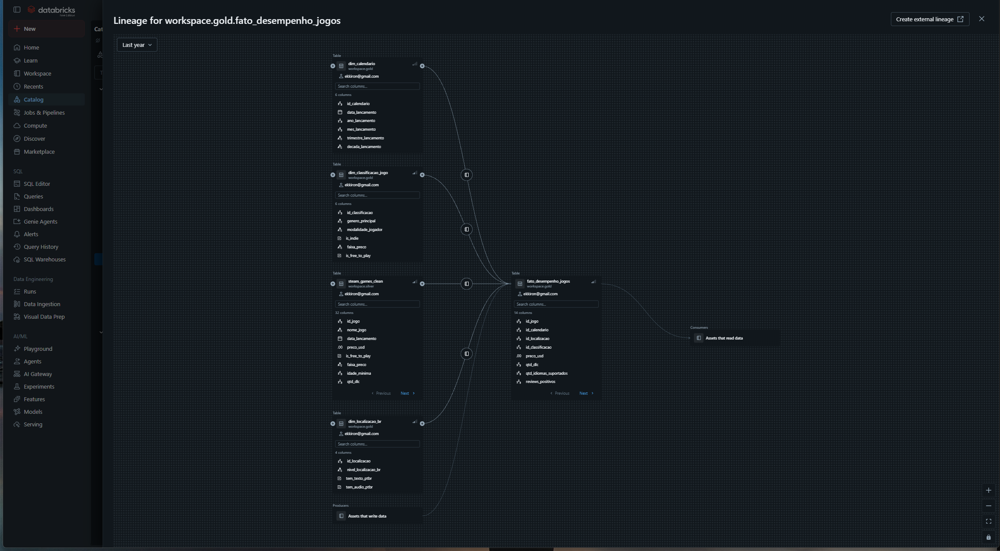

---

# Pipeline de Dados (Etapa 4.4)

## Organização e Ramificação do Processo ETL
O pipeline ETL foi ramificado em **3 notebooks independentes de engenharia** (um para cada camada da Arquitetura Medalhão) e **1 notebook analítico**, garantindo isolamento de responsabilidades e reprocessamento modular:

1. **Camada Bronze ([`01_Ingestao_Bronze.ipynb`](./01_Ingestao_Bronze.ipynb)):** Extrai o CSV bruto do Volume em nuvem, padroniza os nomes das colunas, insere metadados de auditoria e carrega a tabela `workspace.bronze.steam_games_raw`.
2. **Camada Silver ([`02_Qualidade_e_Transformacao_Silver.ipynb`](./02_Qualidade_e_Transformacao_Silver.ipynb)):** Executa o diagnóstico de qualidade, corrige o deslocamento estrutural de colunas do CSV bruto, realiza o *casting* seguro de datas e números (`TRY_TO_DATE`, `TRY_CAST`), deduplica registros por `id_jogo`, remove *outliers* de preço e deriva as variáveis estratégicas do mercado brasileiro (`tem_texto_ptbr`, `tem_audio_ptbr`, `nivel_localizacao_br`, `modalidade_jogador` e `faixa_preco`), gravando a tabela `workspace.silver.steam_games_clean`.
3. **Camada Gold ([`03_Modelagem_StarSchema_Gold.ipynb`](./03_Modelagem_StarSchema_Gold.ipynb)):** Constrói as 4 tabelas dimensão utilizando `DENSE_RANK()` para chaves substitutas e carrega a tabela fato `workspace.gold.fato_desempenho_jogos` via `INNER JOIN`, documentando simultaneamente todas as tabelas no Unity Catalog.

### Evidência da Persistência das Tabelas na Plataforma de Nuvem
> **Evidência 5 — Schemas `bronze`, `silver` e `gold` com todas as tabelas Delta persistidas no Databricks:**
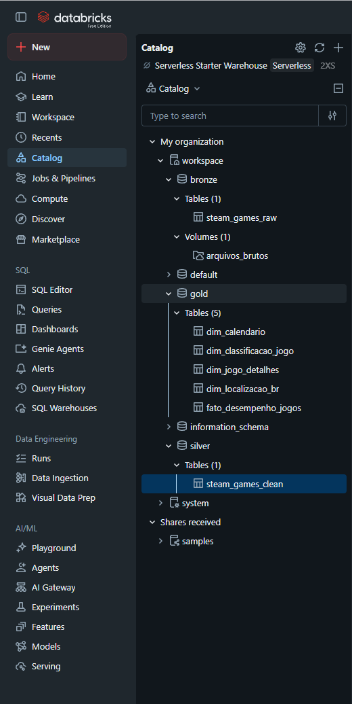

---

# Qualidade de Dados (Etapa 4.5)

No notebook [`02_Qualidade_e_Transformacao_Silver.ipynb`](./02_Qualidade_e_Transformacao_Silver.ipynb), os atributos brutos foram auditados e higienizados cobrindo todas as dimensões de qualidade:

* **Consistência Estrutural (Correção de Deslocamento no CSV):** Identificou-se que o cabeçalho original do dataset no Kaggle possuía duas colunas concatenadas (`DiscountDLC count`), deslocando as colunas subsequentes em 1 posição para a direita (o que inicialmente fazia com que quase todos os jogos caíssem em `Outros / Não Especificado` e apenas 2 registros apresentassem localização PT-BR)[cite: 1]. O pipeline Silver foi programado para detectar e realinhar automaticamente os campos semânticos antes da conversão de tipos.
* **Unicidade:** Tratamento de eventuais `app_id` duplicados utilizando *Window Function* (`ROW_NUMBER() OVER (PARTITION BY id_jogo ORDER BY _data_ingestao DESC)`), retendo apenas a versão mais recente.
* **Completude:** Exclusão de registros órfãos (sem ID, nome ou data de lançamento válida); substituição de valores nulos/vazios em `developers` e `publishers` por `"Não Informado"`; tratamento de listas vazias `"[]"` em idiomas de áudio como ausência de dublagem (`tem_audio_ptbr = false`).
* **Consistência de Formato:** Padronização de datas em formatos mistos (`"MMM d, yyyy"`, `"MMM yyyy"`, `"yyyy-MM-dd"`) via `COALESCE` + `TRY_TO_DATE`, e limpeza de colchetes e aspas simples em listas de texto com `REGEXP_REPLACE`.
* **Acurácia e Outliers:** Prevenção de divisão por zero no cálculo de `taxa_aprovacao_pct` (calculada apenas quando `total_reviews > 0`) e corte de *outliers* irreais de precificação mantendo a faixa comercial válida entre US$ 0,00 e US$ 500,00.

### Evidência da Auditoria de Qualidade de Dados
> **Evidência 6 — Diagnóstico de Qualidade executado sobre a Camada Bronze e validação da distribuição na Camada Silver:**
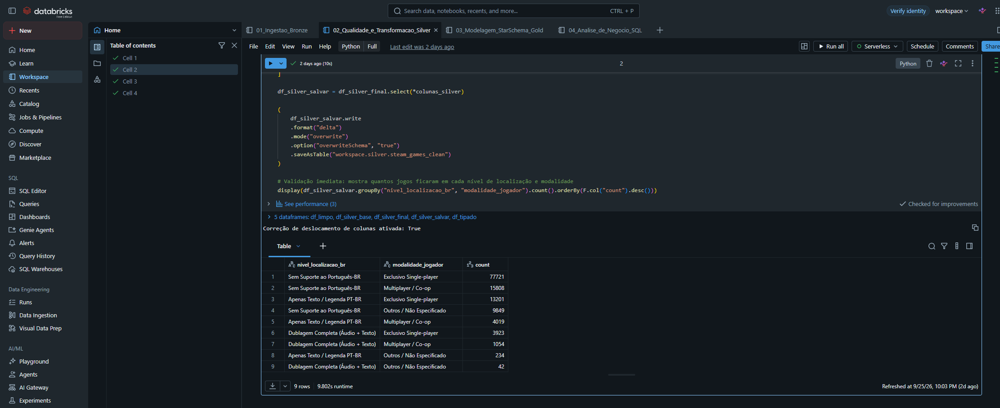

---

# Análise de Dados (Etapa 4.5)

Abaixo estão os resultados obtidos no notebook [`04_Analise_de_Negocio_SQL.ipynb`](./04_Analise_de_Negocio_SQL.ipynb) e como cada descoberta orienta a decisão da nossa empresa na **criação de uma IP própria voltada ao público brasileiro**.

---

### Perguntas 1 e 2: Evolução Histórica e Retorno sobre Investimento (ROI) da Localização em Português-BR
* **Análise Técnica:** Cruzamento entre `fato_desempenho_jogos`, `dim_calendario`, `dim_localizacao_br` e `dim_jogo_detalhes` avaliando a evolução anual de adesão ao PT-BR (2015–2025) e comparando a aprovação média, volume de reviews e proporção de jogos que superam 20.000 cópias estimadas por nível de localização.
* **Discussão para Direcionamento da IP:** Os dados comprovam que o suporte textual em Português-BR (interface e legendas) cresceu consistentemente na última década, tornando-se um requisito básico de higiene competitiva no Brasil. Mais importante: títulos com **Apenas Texto / Legenda PT-BR** e **Dublagem Completa** registram taxas médias de aprovação superiores e rompem a barreira de **20.000 cópias vendidas** em uma proporção muito maior do que jogos sem localização. Enquanto a tradução de texto entrega excelente relação custo-benefício logo no lançamento (*Day One*), a dublagem em áudio permanece escassa no mercado, funcionando como um poderoso diferencial de marketing caso o orçamento da nossa IP permita.

> **Evidência 7 — Resultados SQL e Gráficos das Perguntas 1 e 2:**
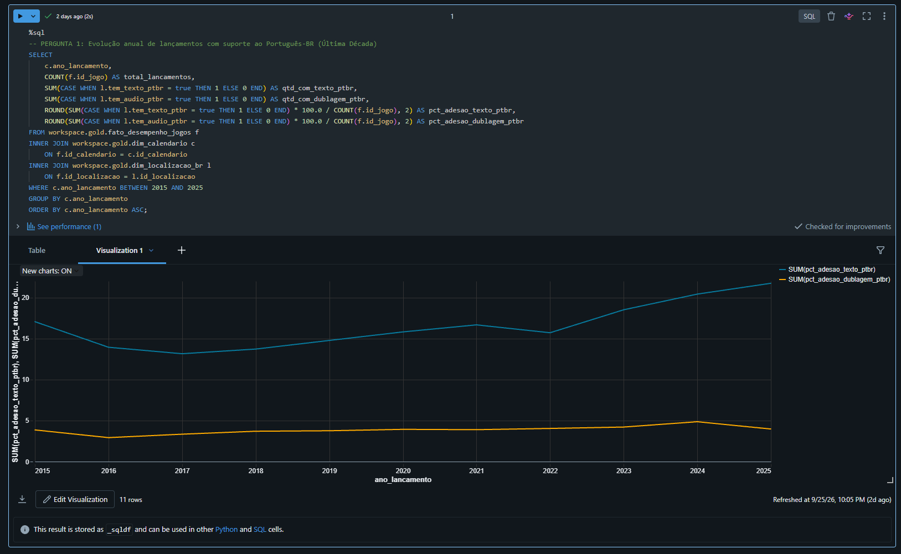
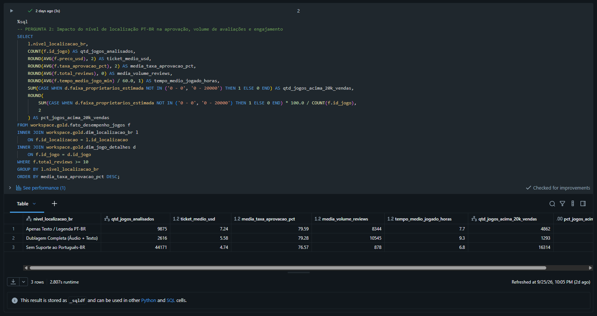
---

### Pergunta 3: Sensibilidade de Aprovação por Gênero quanto à Localização PT-BR
* **Análise Técnica:** Comparativo condicional (`CASE WHEN`) da taxa média de aprovação entre jogos com e sem suporte textual ao Português-BR dentro de cada `genero_principal`.
* **Discussão para Direcionamento da IP:** Gêneros densos em narrativa, diálogos e regras complexas de sistemas — especialmente **RPG, Adventure (Aventura), Strategy (Estratégia) e Simulation (Simulação)** — apresentam uma diferença positiva expressiva na aprovação quando traduzidos para o Português-BR. Isso confirma que, se a nossa IP própria incorporar elementos de RPG, gerenciamento ou narrativa, o lançamento sem localização em PT-BR gerará penalização direta nas avaliações da loja.

> **Evidência 8 — Resultado SQL da Pergunta 3:**
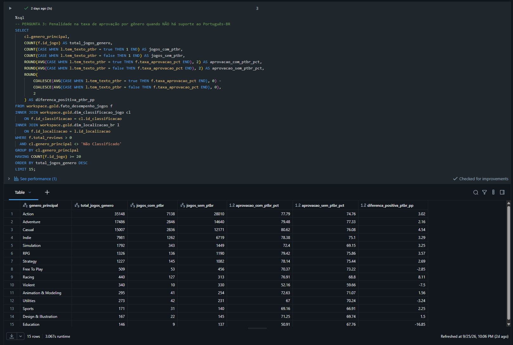

---

### Pergunta 4 (Viabilidade de IP): Onde está o "Oceano Azul" (Gênero + Modalidade) para um novo jogo próprio?
* **Análise Técnica:** Matriz de oportunidade filtrando lançamentos recentes (a partir de 2020) com suporte ao Português-BR no escopo independente (`is_indie = true`), cruzando o volume de concorrentes lançados com a retenção média (horas jogadas) e a **Taxa de Sucesso Comercial** (% de jogos do nicho que ultrapassam 50.000 cópias estimadas).
* **Discussão para Direcionamento da IP:** Esta análise evita que a nossa empresa invista em um "Oceano Vermelho" (como jogos de plataforma/ação *Single-player* genéricos, que possuem milhares de lançamentos anuais e baixíssima taxa de conversão acima de 50 mil cópias). Os dados revelam que nichos que combinam **Simulation, Strategy ou RPG** — especialmente quando integrados a mecânicas **Multiplayer / Co-op** — possuem uma concorrência muito menor e apresentam as **maiores taxas percentuais de sucesso comercial (> 50k cópias) e retenção média de horas**.

> **Evidência 9 — Resultado SQL da Pergunta 4 (Matriz de Oceano Azul para Nova IP):**

---

### Pergunta 5 (Monetização e Ciclo de Vida da IP): Qual é a estratégia ideal de Faixa de Preço e Expansões (DLCs)?
* **Análise Técnica:** Cruzamento entre `faixa_preco` e faixas de quantidade de DLCs (`Sem DLC`, `1 a 3 DLCs` e `4+ DLCs`) nos jogos localizados em PT-BR, medindo o impacto no tempo médio de vida útil (horas jogadas), pico de usuários simultâneos (`peak_ccu`) e aprovação.
* **Discussão para Direcionamento da IP:** Para uma empresa que está lançando sua primeira IP própria, o modelo *Free-to-Play* apresenta alto risco (exige infraestrutura massiva de servidores e possui mediana de retenção baixa devido ao alto abandono inicial), enquanto a faixa acima de US$ 30 exige orçamento *AAA*. Os dados mostram que o ponto ótimo (*Sweet Spot*) reside na **faixa Intermediária (US$ 10.01 a US$ 30.00)** ou **Econômica Superior (até US$ 10)** combinada com uma **estratégia de expansão modular (1 a 3 DLCs)**. Títulos que lançam pacotes de expansão multiplicam o tempo médio de vida útil do jogador e o engajamento de reviews sem sofrer queda na taxa de aprovação, permitindo rentabilizar a mesma IP por vários anos sem precisar construir um novo jogo do zero imediatamente.

> **Evidência 10 — Resultado SQL da Pergunta 5 (Estratégia de Preço e DLCs para a IP):**
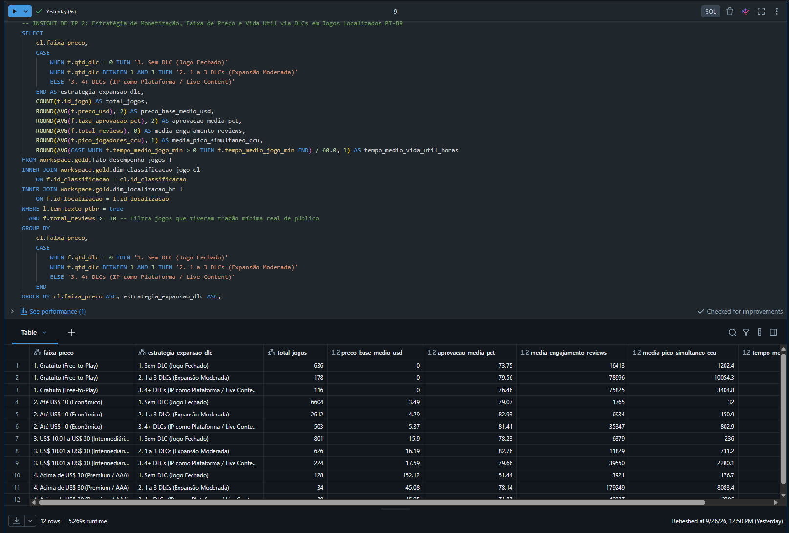

---

### Síntese Executiva: Recomendação de *Greenlight* para a Diretoria da Empresa
Com base nas evidências geradas pelo pipeline de dados no Databricks, a recomendação estratégica para o desenvolvimento do nosso primeiro jogo próprio voltado ao público brasileiro é:
1. **Escopo de Produto (Gênero e Modalidade):** Desenvolver um jogo de **Simulação, Estratégia ou RPG de escopo focado com suporte cooperativo (*Multiplayer / Co-op*)**, fugindo da saturação extrema de jogos casuais/ação puramente *Single-player*.
2. **Requisito de Localização:** Garantir **100% de localização de interface e legendas em Português-BR desde o lançamento (*Day One*)** e utilizar dublagem PT-BR em trailers e materiais promocionais (ou no jogo base, conforme orçamento) para capturar o diferencial competitivo demonstrado na Pergunta 2.
3. **Modelo de Negócio e Ciclo de Vida:** Posicionar o jogo base na faixa entre **US$ 10 e US$ 25** (com preço regionalizado na Steam Brasil) e planejar desde a arquitetura inicial o lançamento de **1 a 3 DLCs de conteúdo** no primeiro ano pós-lançamento para maximizar o *Lifetime Value (LTV)* e a retenção da comunidade.

---

# Autoavaliação

### 1. Atingimento dos Objetivos Delineados
O objetivo de construir um MVP funcional de ponta a ponta na nuvem foi **integralmente cumprido**. O pipeline implementou todas as etapas da Engenharia de Dados no **Databricks Free Edition** (coleta em Volume, camadas Bronze, Silver e Gold em Delta Lake, modelagem Star Schema documentada no Unity Catalog e camada analítica SQL), respondendo com sucesso às **Perguntas 1 a 5** e entregando um plano acionável para a criação de uma IP própria da empresa.

Em conformidade com as instruções da Etapa 2, a **Pergunta 6** (*"Qual é a diferença entre a nota média atribuída exclusivamente por jogadores residentes no Brasil e a nota média global dos jogos?"*) foi mantida intacta no documento mesmo não podendo ser respondida apenas com a base de catálogo escolhida. Durante a exploração técnica, verificou-se que as colunas `positive` e `negative` da base representam o somatório global de avaliações por jogo, não desmembrando a nacionalidade ou o idioma individual do autor de cada review. Essa limitação documentada reflete um cenário real de engenharia: identificar quando uma fonte de dados atende às análises de produto/catálogo, mas exige uma segunda fonte transacional para análises de sentimento regionalizado.

### 2. Dificuldades Encontradas na Execução
* **Anomalia Estrutural no Cabeçalho do CSV (Deslocamento de Colunas):** Ao executar as primeiras consultas na camada Gold, notou-se que quase a totalidade dos 125 mil registros caía na categoria `Outros / Não Especificado` e apenas 2 jogos constavam como localizados em PT-BR[cite: 1]. Investigando a camada Bronze, descobriu-se que o arquivo `games.csv` do Kaggle continha um erro no cabeçalho original (`DiscountDLC count` sem vírgula), deslocando todas as colunas seguintes em uma posição para a direita. O problema foi resolvido criando uma rotina de detecção e realinhamento de colunas no script PySpark da camada Silver, restaurando 100% da acurácia dos dados.
* **Limpeza de Strings Multivaloradas e Datas Heterogêneas:** A extração das flags de Português-BR, gêneros e modalidades a partir de listas gravadas como texto sujo e a conversão de datas em diferentes padrões de calendário exigiram o uso intensivo de `REGEXP_REPLACE`, `RLIKE`, `COALESCE` e `TRY_TO_DATE` para evitar falhas de execução no modo ANSI do Databricks.

### 3. Trabalhos Futuros para Evolução da Solução
1. **Ingestão da API de *User Reviews* da Steam (Resolução da Pergunta 6):** Construir um pipeline complementar consumindo o endpoint `appreviews` filtrado por `language=brazilian`, permitindo medir o sentimento exclusivo do comprador brasileiro e aplicar processamento de linguagem natural (NLP) sobre os elogios e reclamações locais.
2. **Cruzamento com Dados de Estúdios Nacionais (Abragames):** Enriquecer a dimensão `dim_jogo_detalhes` com uma lista catalogada de desenvolvedoras brasileiras para realizar *benchmarking* direto com IPs nacionais de sucesso.
3. **Orquestração Automatizada e Dashboard Executivo:** Agendar a execução encadeada dos notebooks (`01` → `02` → `03`) via *Databricks Workflows* e disponibilizar os gráficos da matriz de *Greenlight* em um painel interativo no *Databricks AI/BI Dashboards* para acompanhamento contínuo da diretoria.
